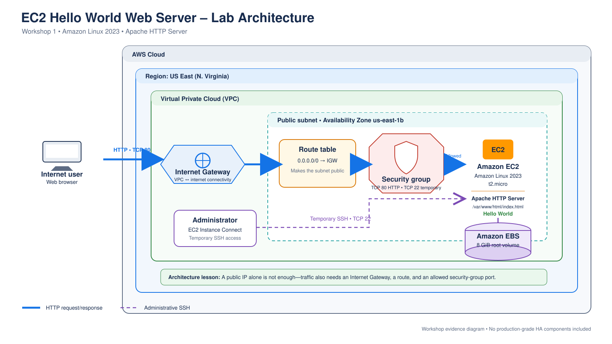

# EC2 Hello World Web Server Lab

> **Status:** Hands-on completed and validated  
> **Level:** Beginner  
> **AWS Region used:** US East (N. Virginia)  
> **Completed:** August 2026  
> **Last reviewed:** August 2026

## Objective

Launch a small Linux virtual server on Amazon EC2, install Apache, publish a basic HTML page, and verify that the page is reachable over the internet.

This lab connects familiar virtual-machine administration concepts with AWS compute, networking, identity, storage, and security controls.

## Architecture

The final request path was:

**Web browser → Internet → EC2 public IPv4 address → Security group TCP/80 → EC2 network interface → Apache HTTP Server → index.html**



The editable source is available in both [draw.io](../../assets/diagrams/ec2-hello-world-architecture.drawio) and [SVG](../../assets/diagrams/ec2-hello-world-architecture.svg) formats. The diagram shows the complete dependency chain: public addressing, an Internet Gateway, a default route, an allowed security-group port, and Apache listening on the instance.

## Resources and Configuration

| Component | Configuration | Purpose |
|---|---|---|
| Amazon EC2 | One `t2.micro` instance | Runs the Linux operating system and Apache |
| AMI | Amazon Linux 2023 | Provides the operating-system image |
| EBS | 8-GiB root volume | Stores the operating system, packages, and webpage |
| Public IPv4 | Automatically assigned | Enables temporary internet access to the instance |
| Security group | Inbound TCP/22 and TCP/80 for the lab | Allows browser-based administration and HTTP traffic |
| EC2 Instance Connect | Browser-based connection | Provides temporary SSH access without a downloaded key pair |
| Apache `httpd` | Installed, started, and enabled | Serves the webpage and starts automatically after reboot |

Resource identifiers, public addresses, account details, temporary credentials, and training-platform material are intentionally excluded.

## What I Did

1. Launched an Amazon Linux 2023 EC2 instance in a public subnet.
2. Used an existing security group that permitted SSH and HTTP for the temporary lab.
3. Waited for both EC2 health checks to pass.
4. Connected through EC2 Instance Connect as `ec2-user`.
5. Confirmed the operating system packages were current.
6. Installed Apache HTTP Server.
7. Started Apache and enabled it for future boots.
8. Created a simple `index.html` page in Apache's document root.
9. Verified the service locally from the instance.
10. Confirmed that the page was reachable through the instance's public IPv4 address.

## Commands Used

```bash
sudo yum update -y
sudo yum install -y httpd
sudo systemctl start httpd
sudo systemctl enable httpd
echo '<h1>Hello World</h1>' | sudo tee /var/www/html/index.html
sudo systemctl status httpd
curl http://localhost
```

## Validation

The deployment was considered successful only after all of the following checks passed:

- EC2 instance state showed **Running**.
- EC2 system and instance status checks showed **2/2 checks passed**.
- `systemctl status httpd` showed **active (running)**.
- The service log confirmed Apache was listening on port 80.
- `curl http://localhost` returned the expected HTML.
- A browser request to the public IPv4 address displayed **Hello World**.

## What I Learned

### Running is not the same as healthy

An instance can enter the Running state before AWS completes its system and instance health checks. I waited for both checks to pass before troubleshooting or connecting.

### Installation is not the same as operation

Installing `httpd` placed the software on disk, but the service still needed to be started. Enabling it separately configured automatic startup after reboot.

### Local and external tests isolate different failure domains

A successful `curl http://localhost` proved that Apache, port 80, and the document root worked inside the instance. The external browser test additionally validated public addressing and the security-group path.

### Public and private addresses serve different purposes

The private IPv4 address supports communication inside the VPC. The automatically assigned public IPv4 address provided temporary internet reachability and was not a persistent Elastic IP.

### EC2 maps naturally to traditional infrastructure

The AMI resembles a VM template, the instance type defines compute capacity, EBS provides the virtual disk, and the security group acts as a stateful virtual firewall. AWS adds API-driven provisioning and cloud-specific networking around these familiar concepts.

## Security Review

The lab intentionally used a simple public design. It should not be treated as a production reference architecture.

Observed limitations:

- HTTP traffic was unencrypted.
- The instance had a public IPv4 address.
- SSH access was permitted broadly by the temporary lab security group.
- The workload ran on a single instance in one Availability Zone.
- There was no load balancer, Auto Scaling, managed certificate, monitoring alarm, backup policy, or web application firewall.

Preferred production improvements:

- Place application instances in private subnets.
- Use an Application Load Balancer as the public entry point.
- Terminate HTTPS with an AWS Certificate Manager certificate.
- Use Systems Manager Session Manager instead of exposing SSH.
- Restrict security-group rules to the minimum required sources and ports.
- Use an Auto Scaling group across multiple Availability Zones.
- Add CloudWatch metrics, logs, alarms, and centralized observability.
- Define backup, patching, vulnerability-management, and recovery requirements.
- Deploy repeatably through Infrastructure as Code.

## Availability and Cost Considerations

This design had a single point of failure. If the instance or Availability Zone failed, the webpage would become unavailable.

A single small instance is inexpensive for learning, but production cost analysis must also include storage, data transfer, load balancing, monitoring, backups, support, and operational effort. Pricing should always be checked against the current AWS pricing pages.

## Cleanup

The resources belonged to a time-limited training environment and expired with the lab session. No account identifiers or reusable credentials were retained.

In a personal AWS account, the cleanup checklist would include:

- Terminate the EC2 instance.
- Confirm whether its EBS root volume was deleted.
- Release any Elastic IP if one was allocated.
- Remove lab-specific security groups after all dependencies are gone.
- Verify that no snapshots, AMIs, load balancers, or other billable resources remain.

## Diagram Review

The completed original diagram shows:

- One internet user/browser
- The AWS Cloud and one VPC boundary
- One public subnet
- An Internet Gateway attached to the VPC
- A route from the public subnet to the Internet Gateway
- A security group allowing HTTP on TCP/80
- One EC2 instance in the public subnet
- Apache and `index.html` inside the instance
- A left-to-right HTTP request path
- A note that SSH TCP/22 was used only for the temporary lab

Do not include real account IDs, instance IDs, IP addresses, DNS names, VPC IDs, subnet IDs, security-group IDs, or temporary credentials.

## Related Learning

- Amazon EC2 fundamentals
- Amazon Machine Images
- EC2 instance types
- Amazon EBS
- Public and private subnets
- Security groups
- Internet gateways and route tables
- EC2 Instance Connect
- Systems Manager Session Manager
- Application Load Balancers and Auto Scaling

## Disclaimer

This is an original learning record based on a temporary hands-on environment. It is not official AWS documentation, and it does not reproduce third-party workshop instructions or proprietary solution material. Verify current implementation guidance against the official AWS documentation.
